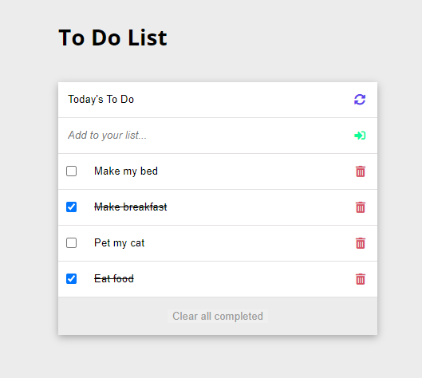

# To Do List

> A simple To do List. It simply lists the things that you need to do and allows you to mark them as complete. A tool to help you organize your day!




## Built With

- HTML
- CSS
- JavaScript
- Webpack

### Setup
If you installed git you can clone the code to your machine, or download a ZIP of all the files directly.
[Download the ZIP from this location](https://github.com/topeogunleye/todo-list/archive/refs/heads/main.zip), or run the following [git](https://git-scm.com/downloads) command to clone the files to your machine:
```bash
git clone https://github.com/topeogunleye/todo-list.git
```

- Once the files are on your machine, open the _todo-list_ folder in [Visual Studio Code](https://code.visualstudio.com/), and follow the steps in Installation & Set Up

## 🛠 Installation & Set Up

1. Install Node Modules

   ```sh
   npm install
   ```

2. Start the development server

   ```sh
   npm start
   ```

3. Open [http://localhost:8080](http://localhost:8080) to view it in the browser.

## 🚀 Building and Running for Production

1. Generate a full static production build

   ```sh
   npm run build
   ```

### Install

The following tools help make easier to work with sample code.

- [git](https://git-scm.com/downloads): A tool for managing source code
- [Visual Studio Code](https://code.visualstudio.com/): A source code editor
- [NVM](https://github.com/nvm-sh/nvm)

## Authors

👤 **Melanie Sigrid**

- GitHub: [@melaniesigrid](https://github.com/melaniesigrid)
- Twitter: [@SiriMoon11](https://twitter.com/SiriMoon11)
- LinkedIn: [LinkedIn](https://www.linkedin.com/in/melanie-arellano-92aaa9194/)

## 🤝 Contributing

Contributions, issues, and feature requests are welcome!

Feel free to check the [issues page](../../issues/).

## Show your support

Give a ⭐️ if you like this project!

## Acknowledgments

- Hat tip to my code reviewers and partners at Microverse.

## 📝 License

This project is [MIT](./MIT.md) licensed.