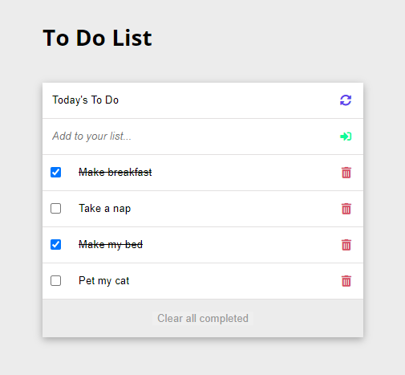

# To Do List

> A simple To do List. It simply lists the things that you need to do and allows you to mark them as complete. A tool to help you organize your day!

## Built With

- HTML
- CSS
- JavaScript
- Webpack

## Live Demo :rocket:

[Live Demo](https://melaniesigrid.github.io/TasksToDo/dist/)

## Getting Started

To get a local copy up follow these simple example steps.

### Prerequisites

- GIT, NODE, NPM

### Setup

Open a terminal or a git bash in the desired directory and run `https://github.com/melaniesigrid/TasksToDo.git`

### Install

The following tools help make easier to work with sample code.

- [git](https://git-scm.com/downloads): A tool for managing source code
- [Visual Studio Code](https://code.visualstudio.com/): A source code editor
- [NVM](https://github.com/nvm-sh/nvm)

## Authors

👤 **Melanie Sigrid**

- GitHub: [@melaniesigrid](https://github.com/melaniesigrid)
- Twitter: [@SiriMoon11](https://twitter.com/SiriMoon11)
- LinkedIn: [LinkedIn](https://www.linkedin.com/in/melanie-arellano-92aaa9194/)

## 🤝 Contributing

Contributions, issues, and feature requests are welcome!

Feel free to check the [issues page](../../issues/).

## Show your support

Give a ⭐️ if you like this project!

## Acknowledgments

- Hat tip to my code reviewers and partners at Microverse.

## 📝 License

This project is [MIT](./MIT.md) licensed.